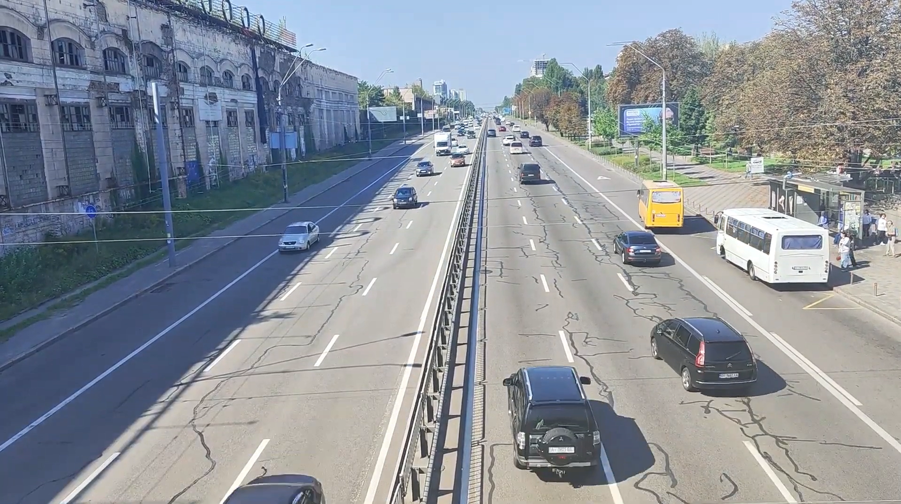
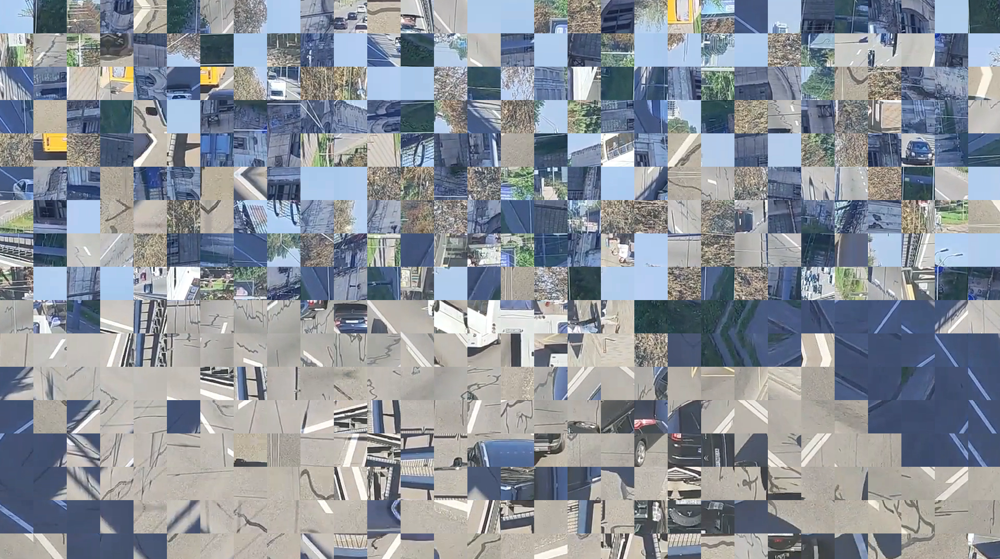

# ImageEncryption  
**Block-based image & video scrambling using LFSR (Python, OpenCV)**

Цей репозиторій реалізує **low-cost шифрування (scrambling)** для зображень та відео.  
Алгоритм працює шляхом **розбиття кадру на блоки**, опційної **локальної трансформації блоків**
(rotate / flip) та **перестановки блоків** за допомогою псевдовипадкового генератора на основі **LFSR**.

---

## Зміст
- [Коротке пояснення](#коротке-пояснення)
- [Приклади CLI](#приклади-cli)
- [Параметри та ключі](#параметри-та-ключі)
- [Загальна архітектура](#загальна-архітектура)
- [Алгоритм роботи](#алгоритм-роботи)
- [Опис модулів](#опис-модулів)
- [Робота з відео](#робота-з-відео)
- [Приклад обробки](#приклад-обробки)
---

## Коротке пояснення

### Encrypt
1. Кадр / зображення **паддиться** до кратності `tile_size`
2. Ділиться на блоки `tile_size × tile_size`
3. Для кожного раунду:
   - (опційно) rotate/flip кожного блоку
   - перестановка блоків (Fisher–Yates) з PRNG на LFSR
4. Блоки збираються назад
5. Padding прибирається

### Decrypt
1. Робиться **той самий padding**
2. Блоки діляться так само
3. Раунди виконуються **у зворотному порядку**:
   - inverse permutation
   - inverse rotate/flip
4. Збірка кадру + unpad

Encrypt і decrypt **симетричні**.  
Будь-яка невідповідність параметрів → неправильний результат.

---

## Приклади CLI

### Зображення
```bash
python encrypt_image.py media/input.png media/encrypt.png --seed 333 --tile-size 64 --rounds 5
python decrypt_image.py media/encrypt.png media/decrypt.png --seed 333 --tile-size 64 --rounds 5
```

### Відео
```bash
python encrypt_video.py media/input.mp4 media/encrypt.mp4 --seed 333 --tile-size 64 --rounds 5
python decrypt_video.py media/encrypt.mp4 media/decrypt.mp4 --seed 333 --tile-size 64 --rounds 5
```

## Параметри та ключі

| Параметр         | Опис                      |
| ---------------- | ------------------------- |
| `seed`           | Ключ (LFSR initial state) |
| `tile-size`      | Розмір блоку (px)         |
| `rounds`         | Кількість раундів         |
| `--no-transform` | Вимкнути rotate/flip      |
| `codec`          | Відеокодек                |

🔴 **ВАЖЛИВО**
Параметри seed / tile-size / rounds / no-transform мають бути ідентичні для encrypt і decrypt.

## Загальна архітектура
```
ImageEncryption/
├── media/              # тека файлів для обробки
├── cipher.py           # ядро шифрування
├── tiles.py            # робота з блоками (split / merge / padding)
├── lfsr.py             # LFSR генератор
├── prng.py             # randint() поверх LFSR
├── video_pipeline.py   # покадрова обробка відео
├── encrypt_image.py    # CLI: encrypt image
├── decrypt_image.py    # CLI: decrypt image
├── encrypt_video.py    # CLI: encrypt video
├── decrypt_video.py    # CLI: decrypt video
├── config.py           # дефолтні параметри
└── README.md
```

## Алгоритм роботи

### Перестановка блоків
   * Кількість блоків:  
     `N = (H_pad / tile_size) × (W_pad / tile_size)`
   * Генерується перестановка perm[0..N-1]
   * Блок i переміщується у позицію perm[i]

### PRNG
   * Базується на Fibonacci LFSR
   * Seed ≠ 0
   * Для shuffle використовується randint() з rejection sampling

### Трансформація блоків
   * Для кожного блоку генерується code ∈ [0..7]:
   * 2 біти - поворот (0°, 90°, 180°, 270°)
   * 1 біт - горизонтальний flip

## Опис модулів
`lfsr.py`

**Призначення:** псевдовипадковий генератор бітів
* LFSR(width, taps, state)
* step_bit() - 1 крок регістру
* randbits(n) - n псевдовипадкових бітів

---

`prng.py`

**Призначення:** генерація рівномірних цілих чисел
* `LfsrPrng.randint(a, b)`
* використовує rejection sampling (без bias)
---

`tiles.py`

**Призначення:** робота з блоками
* `pad_to_tile_size()` - padding до кратності tile_size
* `unpad_tile_size()` - обрізка padding
* `split_tiles()` - поділ на блоки
* `merge_tiles()` - збирання назад

Гарантує однаковий розмір усіх блоків.

---

`cipher.py`

**Призначення:** ядро шифру
* `build_permutation()` - Fisher-Yates shuffle
* `invert_permutation()`
* `apply_permutation()`
* `transform_tile()` / `inverse_transform_tile()`
* `encrypt_image()`
* `decrypt_image()`

Саме тут реалізована симетрія encrypt/decrypt.

---

`video_pipeline.py`

**Призначення:** обробка відео кадр за кадром
* `VideoJob` - конфігурація задачі
* `process_video()`:
   * `VideoCapture`
   * encrypt/decrypt кожного кадру
   * `VideoWriter`
   * safety resize

---

### CLI файли

`encrypt_image.py` / `decrypt_image.py`
`encrypt_video.py` / `decrypt_video.py`

**Призначення:** парсинг аргументів та виклик ядра.

## Робота з відео

* Відео обробляється покадрово
* Padding робиться на кожному кадрі
* Після merge кадр повертається до початкового розміру


## Приклад обробки
`input.png`  


`encode.png`  


`decode.png`  
